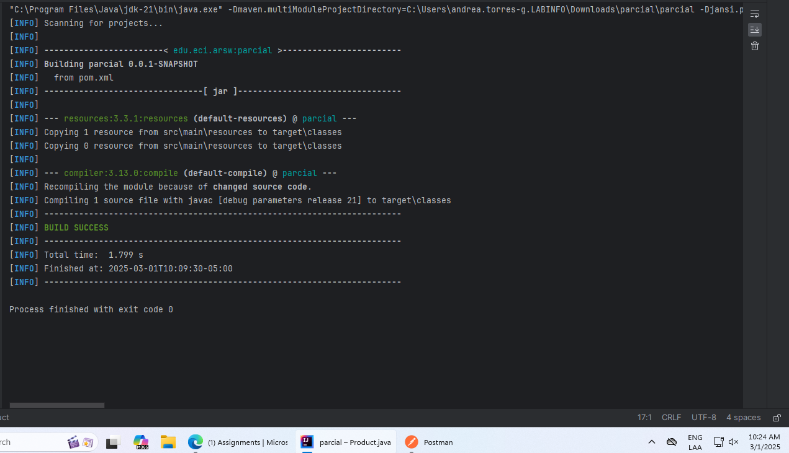
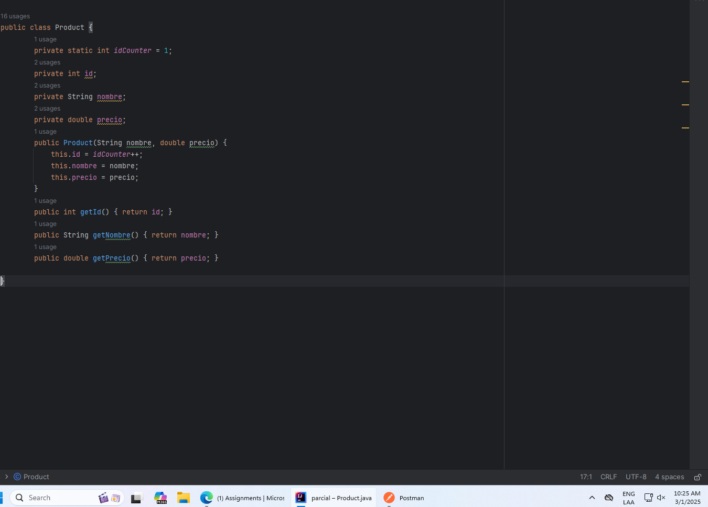
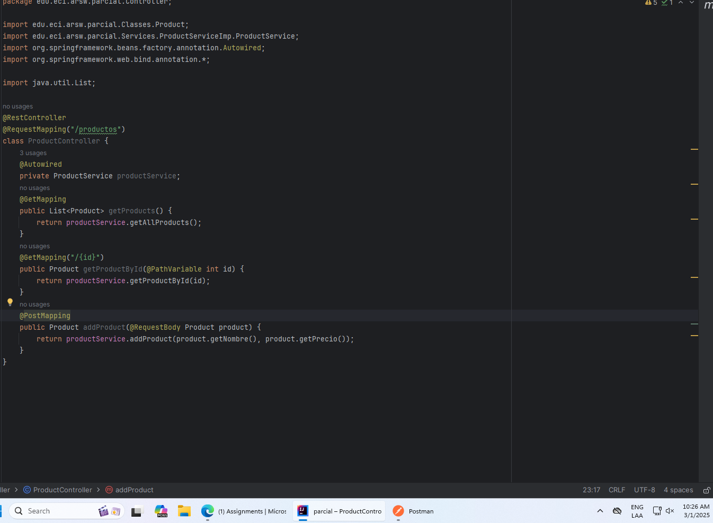
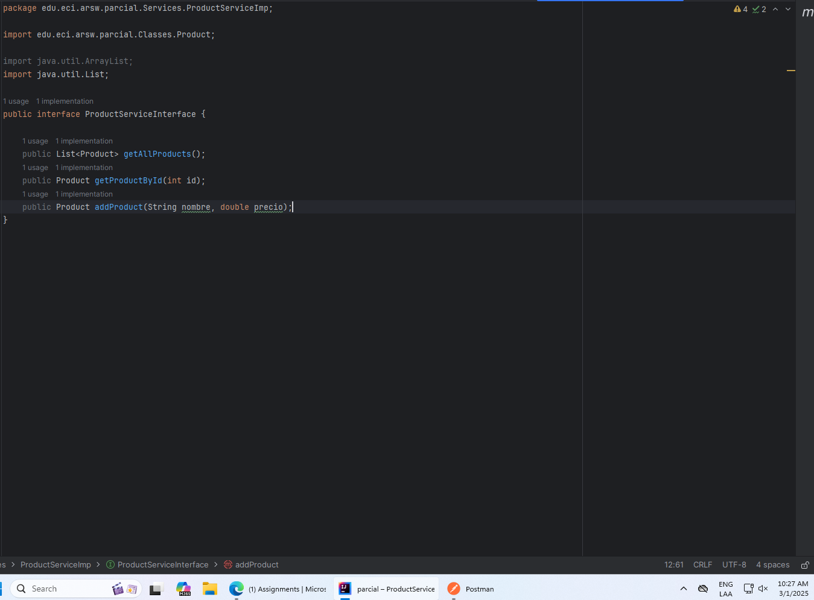
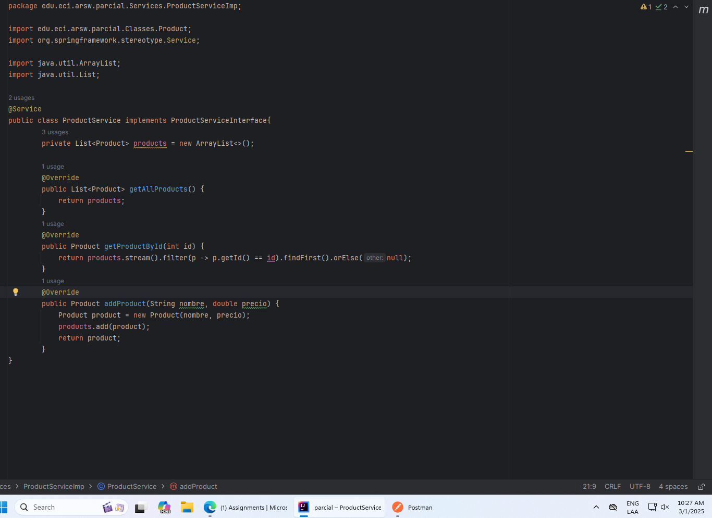
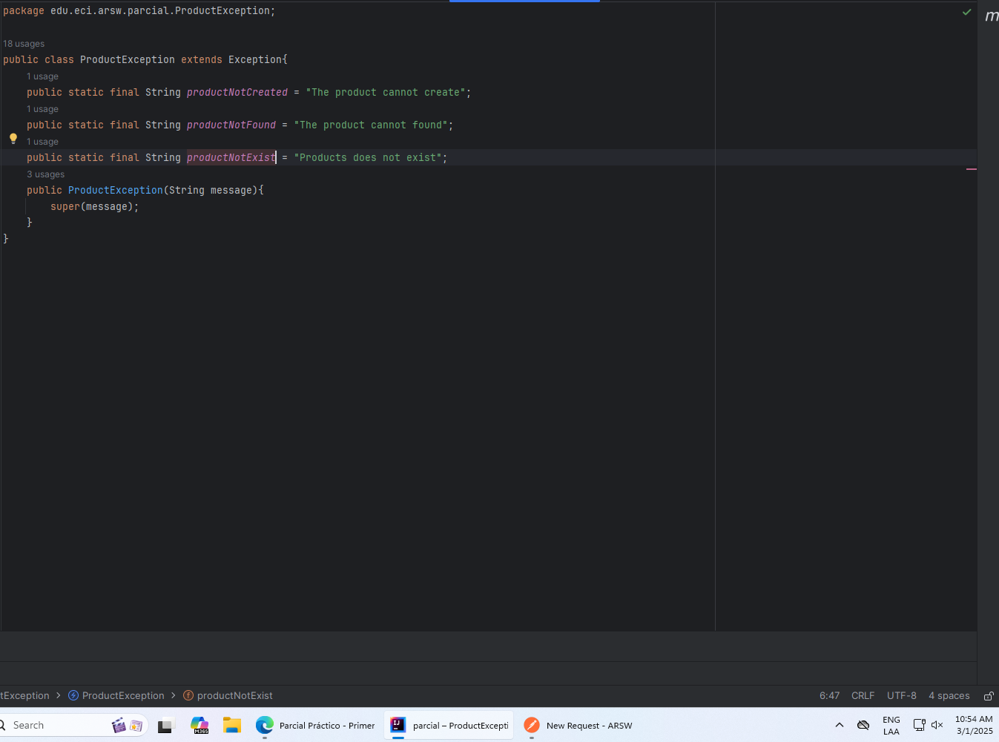
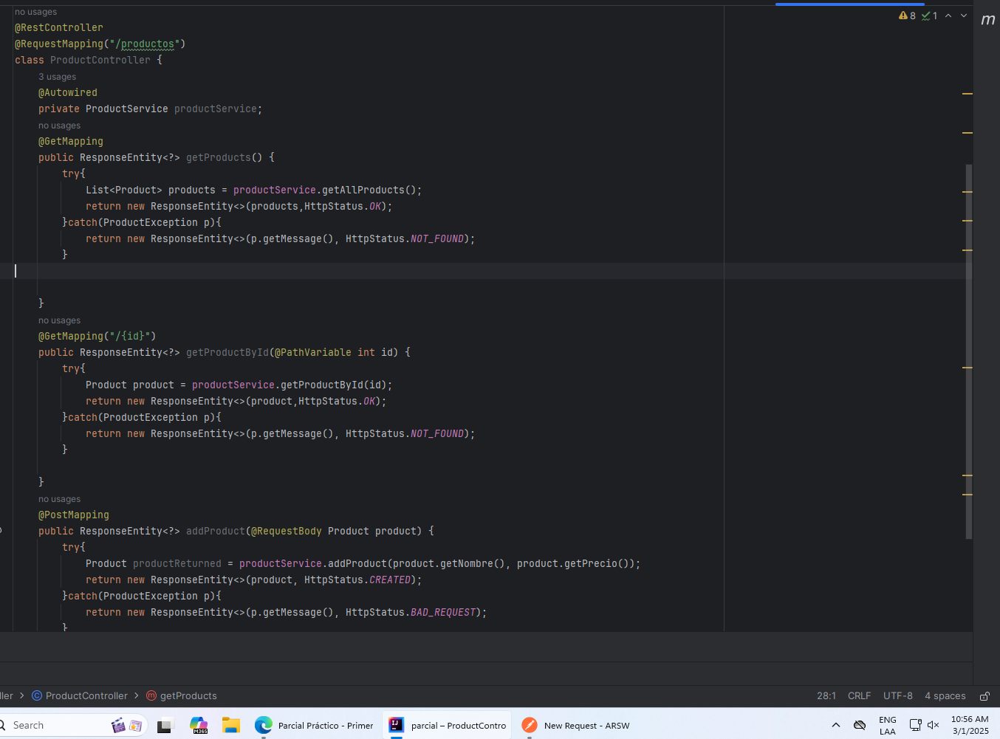
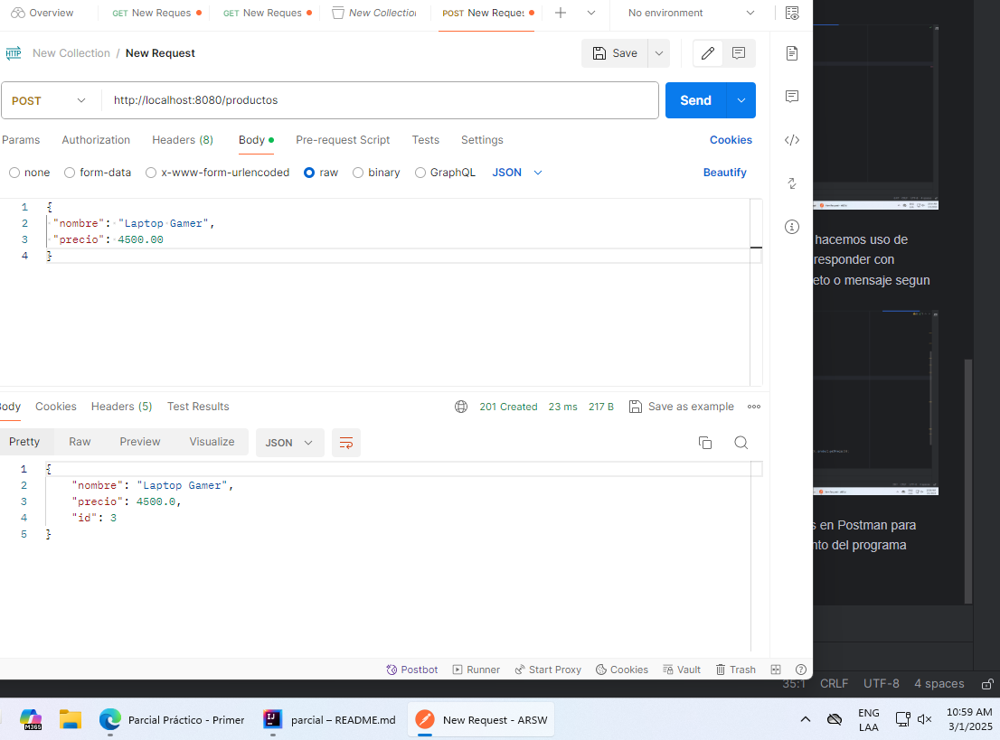
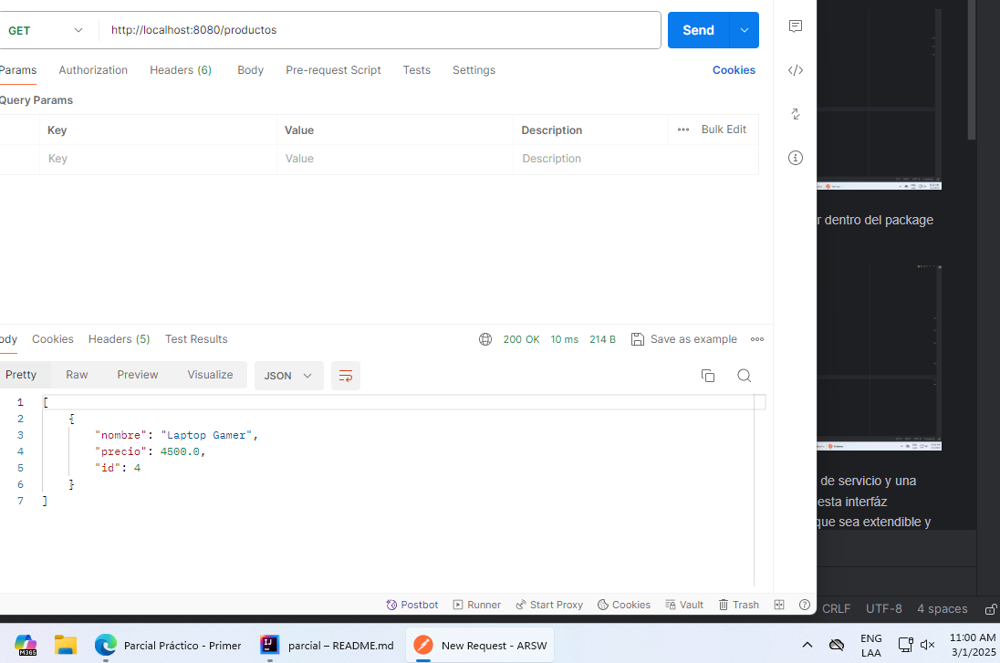
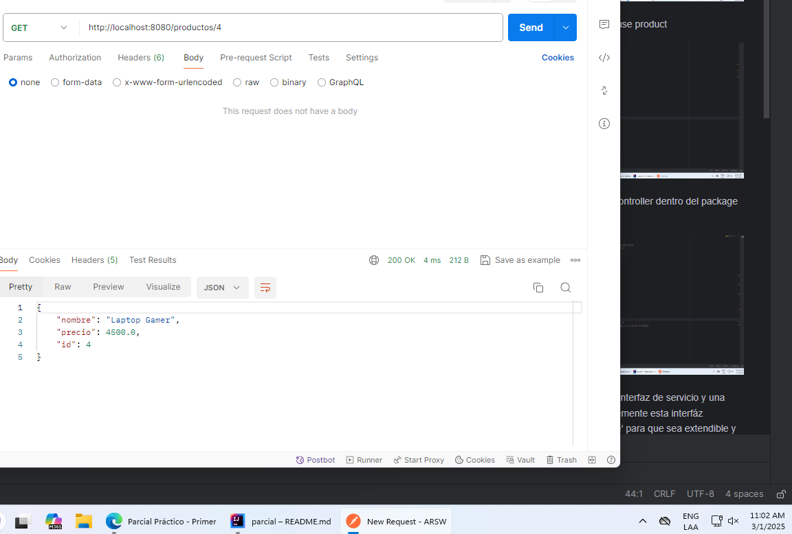

# Parcial 1er tercio
# Andrea Camila Torres González

* Creación del proyecto en springboot
Primero vamos a spring initializr y creamos el proyecto en springboot indicandole las dependencias necesarias,
una vez descargado lo abrimos y agragamos las clases correspondientes

Compilamos el proyecto usando mvn package

*Creamos la clase product

*Añadimos el controller dentro del package 'Controller'

*Creamos una interfaz de servicio y una clase que implemente esta interfáz 'ProductService' para que sea extendible y adaptable

*Agregamos la clase de excepciones para controlar los diferentes caminos, cuando se envian parametros vacios, la colección está vacia o nula

*En la clase Controler hacemos uso de Response Entity para responder con codigos HTTP y el objeto o mensaje segun corresponda

*Hacemos las pruebas en Postman para probar el funcionamiento del programa
<ol>
<li>Metodo Post</li>

<li> Metodo para obtener todos los productos </li>

<li> Metod para obtener un producto en específico por ID</li>

</ol>

